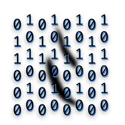
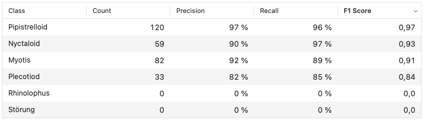
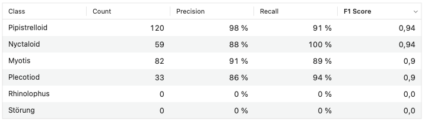

## Welcome to CoreMLBats

CoreMLBats is provided by ecoObs GmbH and Volker Runkel as a demo application that uses Apple ML framework and a trained image model for classification of bat calls based on sonagrams of single calls and in its version 2 it includes various models for classifying tabular data as well. Download the [binary version ready to run](https://github.com/vrunkel/CoreMLBats/blob/master/docs/CoreMLBats.zip)



### Requirements for classification of sonagram images

The input images must be sonograms created as black and white images with a dimension of 512 to 512 pixels. The call itself should be rendered exactly centered as black outline with no or as little noises around the call. FFT settings must be 1024 window size, overlap 96% and optimally a harris window. This can be best achieved using bcAnalyze 3 and a custom color gradient. After selecting a call in the measurement sonogram of [bcAnalyze 3 Pro Standalone](https://ecoobs.com/products/software/bcanalyze/) you can right click and choose to save a single image of the marked call (save model call ; Markierten Ruf speichern). This will create the 512x512 png image for analysis with CoreMLBats. See an example call:


### Colormap for bcAnalyze 3

When creating the sonagram images, a black and white image is the result needed for CoreMLBats. This is most easily achieved using the [supplied colormap](colormapbw2.tif) as user-defined colormap in bcAnalyze3. Note this colormap also allows high quality call presentation for reports and other printed work.


### How was the model trained?

For training the model a selection of calls of our reference database were plotted as image and then within an Xcode playground a model was caluclated. The code used for this is:

```
import Cocoa

import CreateMLUI

let builder = MLImageClassifierBuilder()
builder.showInLiveView()
```
Iterations were set to 50 and a separate validation set of calls was supplied.

### Requirements for classification of tabular data

As input a modified batIdent2 file is needed. The batIdent2 file holds measurements generated by bcAnalyze 4 or bcAdmin (latest versions). For use with CoreMLBats floating points have to be stored as . instead of , and columns need to be separated by , instead of tab. This change can easily be done using BBEdit or TextWranglers search and replace. See an example file Eptesicus.csv in this repo.

The two used algorithms are boostedForest and randomForest with the following evaluation results:



As described by Apple the model is evaluated using precision and recall [https://developer.apple.com/documentation/createml/mlclassifiermetrics/precisionrecall]: 

Precision and recall are metrics calculated for each class. Together they describe the tradeoff between misapplying a label too liberally and missing examples of that label.
Precision describes how effective the model was at applying a label only when appropriate for a given category (few false positives).
Recall describes how effective the model was at finding all the relevant examples of a category (few false negatives).
